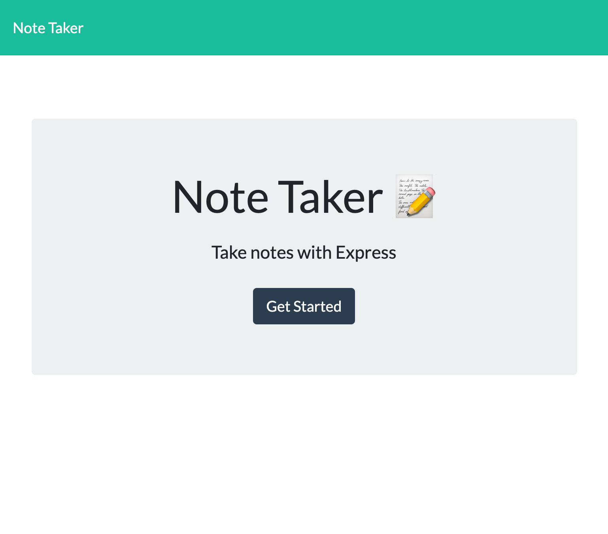
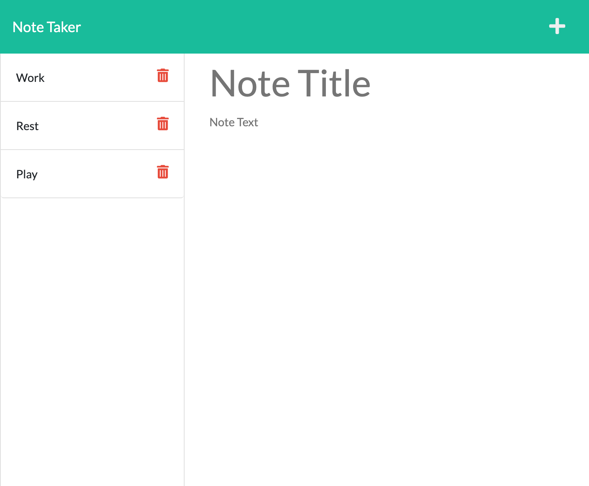

# Note Taker

  
  
  ## Description
  Application to record notes and delete when no longer required
  
  ## Table of Contents
  - [Description](#description)
  - [Installation](#installation)
  - [Usage](#usage)
  - [License](#license)
  - [Contributing](#contributing)
  - [Tests](#tests)
  - [Questions](#questions)
  
  ## Installation
  Application has been deployed using heroku. Use below link. Landing page will present, click get started to move to the notes page. Add your note title and note. Click save.
  
  ## Usage
  Application is used for recording notes

  ## Link

  [Site has been deployed using heroku.](https://salty-sea-36487.herokuapp.com/)

  ## Application example

  
  
  
  ## License
  
  
   
  This application is covered under the MIT license.

  ## Contributing
  Please contact me to contribute or fork repository

  ## Tests
  No tests included.

  ## Questions
  Please contact me via GitHub if you experience any issues.
  
  Find me on GitHub: [Lukemcmi](https://github.com/Lukemcmi)
  
  Email me if you have any questions: n/a

